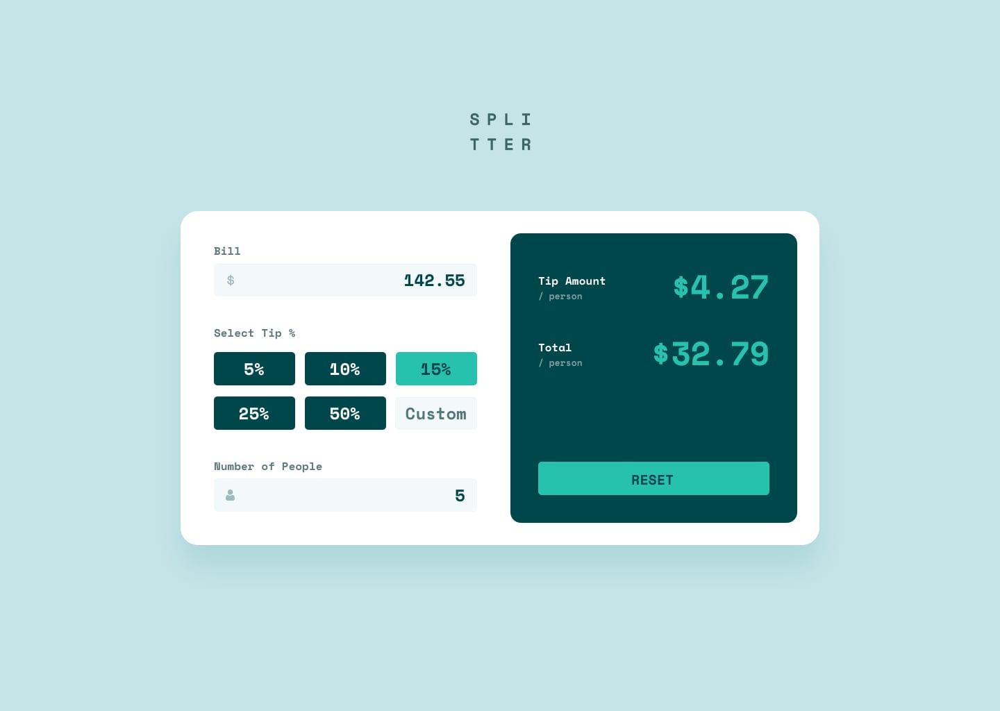

# Tip calculator app

## Welcome! 👋

This is my solution to the [Tip calculator app challenge on Frontend Mentor](https://www.frontendmentor.io/challenges/tip-calculator-app-ugJNGbJUX).

Nice challenge, completed using pure HTML, CSS and vanilla JS. Realy cool one, improved a lot handling forms, learned a lot about events.

The app is a tip calculator, in which the user enter the bill value, the tip fee, and number of people which the price will be divided. It automatically shows the value as soon the user passes the inputs, and it has the functinality to reset it. It prevents errors, such dividing the bill by zero person, or entering non-number values. And as always, 100% responsive.

## Live Preview

You can access the web app on the following [link](https://tipcalculator-lucascarvalho.netlify.app/)!
